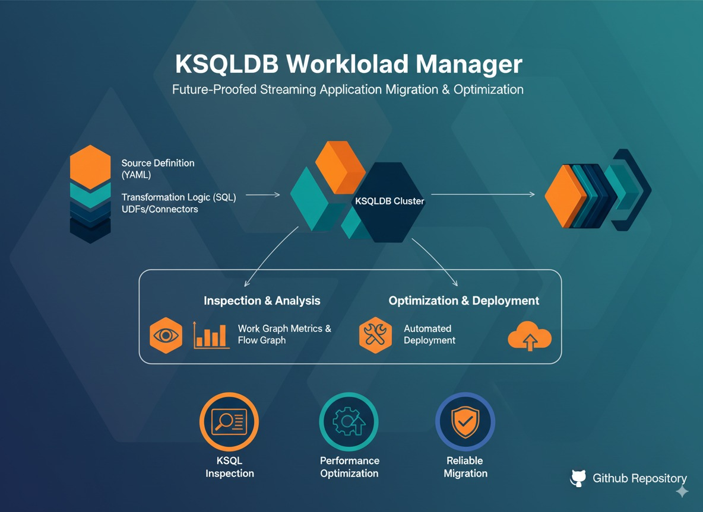
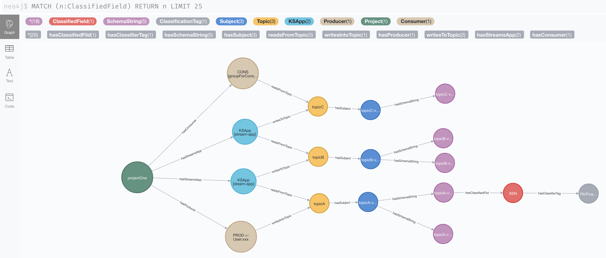
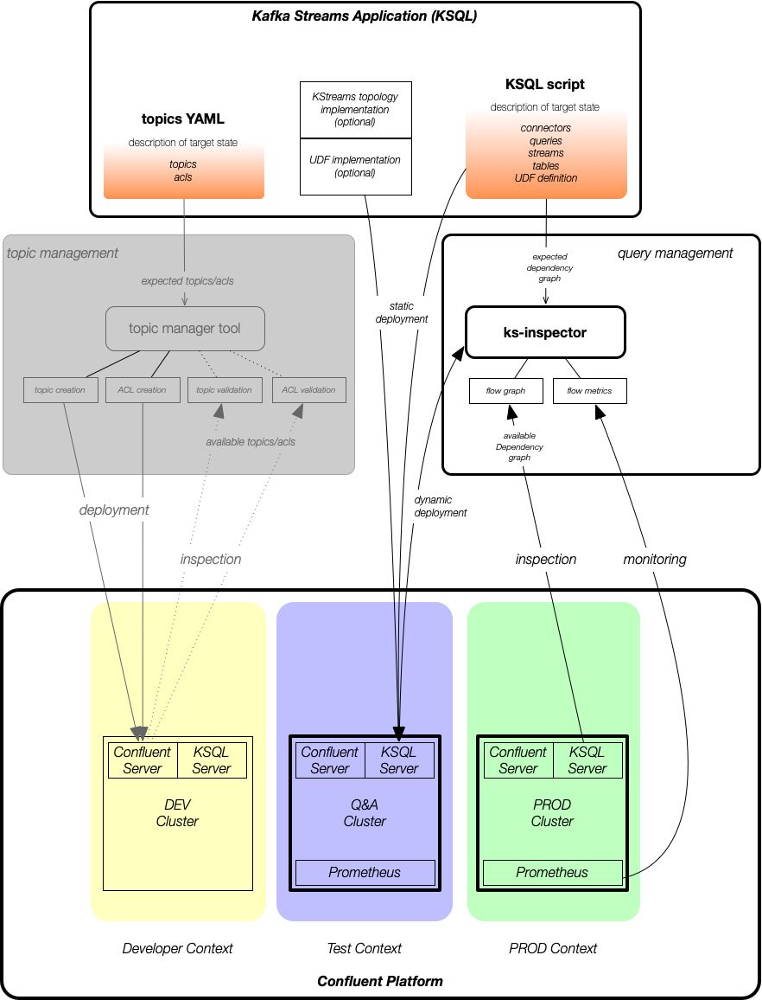
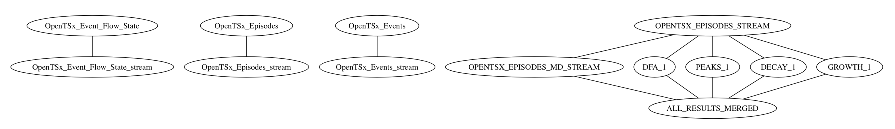

# Scalytics-Connect: KSQLDB-Inspector


KS-Inspector is a tool to understand Kafka based streams applications better.

> **🚀 Modernized Version (v2.0)**: This project has been significantly updated to Java 21 and modernized dependencies while maintaining backward compatibility. The external `kafka-clusterstate-tools` dependency has been eliminated and replaced with self-contained modern implementations in the `io.confluent.ks.modern.*` package structure.

The tool helps application developers and operators of Kafka Streaming applications to understand dependencies between KSQL queries and KStreams applications.
Using the metadata graph we are able to identify components which process sensitive information.

<a href="https://codeclimate.com/github/kamir/ks-inspector"></a>  [](https://travis-ci.com/kamir/ks-inspector)

## 🚀 Modern Architecture (v2.0)

The project has been modernized with the following key improvements:

- **Java 21**: Upgraded from Java 8 to modern Java 21
- **Self-contained**: Eliminated external `kafka-clusterstate-tools` dependency
- **Modern Dependencies**: Updated to Confluent Platform 7.6.0 and Kafka 3.7.0
- **Clean Architecture**: Introduced `io.confluent.ks.modern.*` package structure
- **Jackson Integration**: Modern YAML/JSON processing with Jackson
- **Enhanced Domain Model**: Improved domain classes with better Neo4j integration

### Modern Components

- **Domain Model** (`io.confluent.ks.modern.model.*`): Modern Jackson-annotated domain classes
- **Parser Layer** (`io.confluent.ks.modern.parser.*`): YAML/JSON domain file parsing
- **Kafka Integration** (`io.confluent.ks.modern.kafka.*`): Modern Kafka Admin Client wrapper
- **Utilities** (`io.confluent.ks.modern.utils.*`): Environment variable processing and CLI tools

## Motivation and Concept

Think about a set of KSQL queries you want to deploy on a KSQL cluster. This is a very easy task. 
And many users love the flexibility of scalable deployments using containers.

But there is another side of it. Do you know how individual streaming applications depend on each other in
a direct or indirect way?

### The Application Context
We define an *application context* in order to provide all required information for an
analysis of a particular *streaming use-case*. 
This also works for for multiple uses cases in a multi-tenant environment.

The application context consists of:

- the list of expected topics
- the KSQL queries which implement the application
- the topology which defines the streaming application
- the hostname of the host on which the application is started
- URL to connect to the KSQL server's REST-API



### The Flow-Dependency-Graph
Individual queries consume data from one or more topics (streams/tables) and they produce results 
in another stream or in a materialized form, as a topic, from which other applications can take the 
datta for further processing. 

Like software libraries have dependencies, such flows have dependencies as well.

The flow dependency graph shows those dependencies in the context of an application deployment, 
and in the wider context of a Kafka cluster deployment (with many use cases). 

Therefore, we read the state of one or more KSQL servers and compare it with the expected setup, based on deployed KSQL queries. 

Using KStreams application parameters and the dump of the topology of an KStreams application we are able to
provide a comprehensive view of interdependent flows on a Kafka cluster or on Confluent cloud.

#### With this information we are able to:

- analyse existing KSQL queries which are deployed to the KSQL server already.
- compare the expected queries / streams / tables / topics with available queries / streams / tables / topics.
- identify any mismatch 
- find potential problems in the operational, implementation, or even design context.



### How to use the tool?

> **⚠️ Java 21 Required**: This modernized version requires Java 21. Please ensure your environment is configured accordingly.

You can run the tool via Maven with the `mvn exec:java` command using custom profiles.
This makes it easy to use it with automation tools in an CI/CD context.

Alternatively, you can start the main class of the project: `io.confluent.ksql.KSQLQueryInspector` in your favorite JVM. 

The following arguments are used by *ks-inspector*:

```
usage: KSQLQueryInspector :

 -bss,--bootstrap.servers <arg>   the Kafka bootstrap.servers ... [OPTIONAL]
 
 -ks,--ksql-server <arg>          the hostname/IP of the KSQL server we want to work with [REQUIRED]
 
 -p,--projectPath <arg>           BASE PATH for streaming app topology-dumps and KSQL scripts 
                                  ... this is the place from which the custom data is loaded [REQUIRED]
 
 -qf,--queryFileName <arg>        Filename for the KSQL query file which needs to be analysed 
                                  ... this is the central part of the analysis [REQUIRED]
```                                 

To point to your own application context, please provide the following arguments:

- *p*
- *ks*
- *bss*
- *qf*

as properties in the `pom.xml` file as shown in this example:

```
    <!-- use custom project and overwrite default settings for KSQL application context.  -->
    <profiles>
        <profile>
            <id>p1</id>
            <properties>
                <maven.test.skip>true</maven.test.skip>
                <argument1k>-p</argument1k>
                <argument1v>/Users/mkampf/Engagements/KSQL/P1</argument1v>
                <argument2k>-ks</argument2k>
                <argument2v>127.0.0.1</argument2v>
                <argument3k>-bss</argument3k>
                <argument3v>127.0.0.1:9092</argument3v>
                <argument4k>-qf</argument4k>
                <argument4v>script1.ksql</argument4v>
            </properties>
        </profile>
    </profiles>
```
Now you start the program with `mvn exec:java -Pp1`.

### How to draw the dependency graph?



The tool produces a dependency graph as a `.dot` file in the folder `insights` within your working directory.

Using the Graphviz tool we are able to render a dependency network as a PDF file.
```
dot -Tpdf insights/opentsx.ksql.dot -o pdf/opentsx.pdf
```
Source: https://github.com/rakhimov/cppdep/wiki/How-to-view-or-work-with-Graphviz-Dot-files

### How to get the currently deployed queries from KSQL server via REST API?

```
curl -X "POST" "http://localhost:8088/ksql" \
     -H "Content-Type: application/vnd.ksql.v1+json; charset=utf-8" \
     -d $'{
  "ksql": "LIST STREAMS;",
  "streamsProperties": {}
}' > streams.data
```

```
curl -X "POST" "http://localhost:8088/ksql" \
     -H "Content-Type: application/vnd.ksql.v1+json; charset=utf-8" \
     -d $'{
  "ksql": "LIST TABLES;",
  "streamsProperties": {}
}' > tables.data
```

```
curl -X "POST" "http://localhost:8088/ksql" \
     -H "Content-Type: application/vnd.ksql.v1+json; charset=utf-8" \
     -d $'{
  "ksql": "LIST QUERIES;",
  "streamsProperties": {}
}' > queries.data
```

> **⚠️ Java 21 Required**: This modernized version requires Java 21. Please ensure your environment is configured accordingly.

Source: https://rmoff.net/2019/01/17/ksql-rest-api-cheatsheet/
