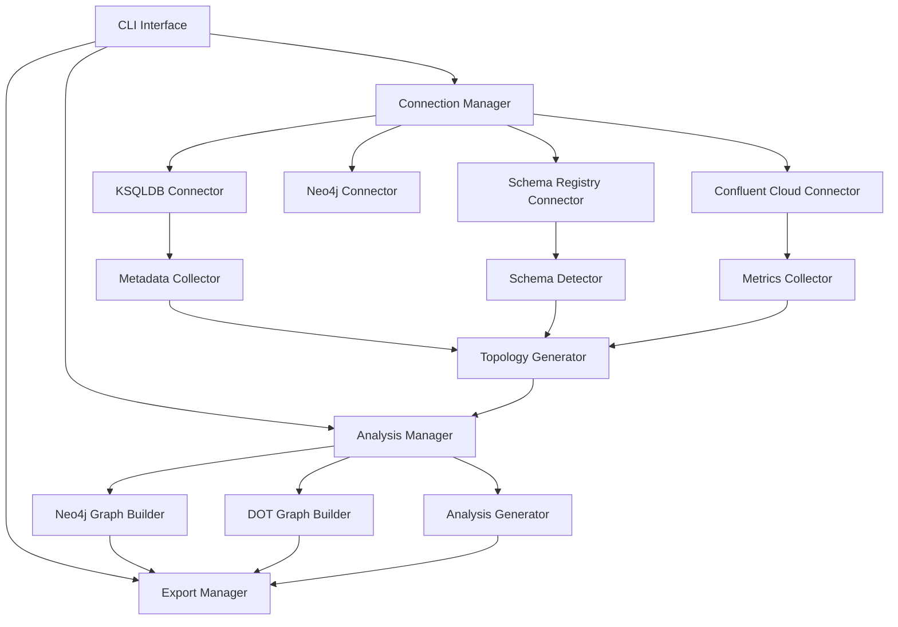

# SD-01: Enhanced KSQLDB Metadata Collection and Topology Visualization - Solution Design

## Solution Design Overview

### Related Feature Request
[FR-01: Enhanced KSQLDB Metadata Collection and Topology Visualization](FR-01.md)

### Status
**DRAFT** - Under review

### Version
1.0

### Author(s)
Solution Architect

### Date Created
2025-01-02

---

## Executive Summary

This solution design outlines the technical approach to enhance the ks-inspector tool with comprehensive KSQLDB metadata collection, advanced topology analysis, Neo4j integration, and multi-source data integration capabilities. The solution maintains backward compatibility while adding significant new functionality through a modular architecture.

---

## Architecture Overview

### Current Architecture Analysis

The existing ks-inspector follows a CLI-driven architecture with these components:
- `CLI.java` - Main entry point and command processing
- Basic KSQLDB client connectivity via `KSQLDBClient.java`
- Simple graph generation with JGraphT
- DOT file export capability
- Basic dependency analysis

### Proposed Architecture Enhancements

#### High-Level Architecture



### Component Design

#### 1. Enhanced Connection Manager (`io.confluent.cp.connector`)

**Purpose**: Centralized connection management for all external systems

**Key Classes**:
```java
public class ConnectionManager {
    private KSQLDBConnector ksqldbConnector;
    private SchemaRegistryConnector schemaConnector;
    private ConfluentCloudConnector cloudConnector;
    private Neo4jConnector neo4jConnector;
}

public interface Connector<T> {
    T connect(ConnectionConfig config) throws ConnectorException;
    boolean isHealthy();
    void disconnect();
}
```

**Responsibilities**:
- Manage connection lifecycle for all external systems
- Handle authentication and security
- Implement connection pooling and retry logic
- Provide health monitoring

#### 2. Comprehensive Metadata Collector (`io.confluent.cp.metadata`)

**Purpose**: Collect complete metadata from KSQLDB servers

**Key Classes**:
```java
public class KSQLDBMetadataCollector {
    public List<TopicMetadata> getAllTopics();
    public List<StreamMetadata> getAllStreams();
    public List<TableMetadata> getAllTables();
    public List<QueryMetadata> getAllQueries();
    public QueryTopology getQueryTopology(String queryId);
}

public class TopicMetadata {
    private String name;
    private Map<String, String> config;
    private int partitionCount;
    private int replicationFactor;
    private List<PartitionMetadata> partitions;
}
```

**Responsibilities**:
- Execute KSQL REST API calls for metadata collection
- Parse and normalize metadata responses
- Cache metadata for performance optimization
- Handle pagination for large result sets

#### 3. Schema Registry Integration (`io.confluent.cp.schema`)

**Purpose**: Integrate with Schema Registry for complete schema information

**Key Classes**:
```java
public class SchemaRegistryCollector {
    public List<SchemaMetadata> getAllSchemas();
    public SchemaEvolution getSchemaEvolution(String subject);
    public CompatibilityInfo checkCompatibility(String subject, String schema);
}

public class SchemaMetadata {
    private String subject;
    private int version;
    private String schemaType;
    private String schemaDefinition;
    private Map<String, Object> config;
}
```

#### 4. Enhanced Topology Generator (`io.confluent.mdmodel.topology`)

**Purpose**: Generate comprehensive streaming topology graphs

**Key Classes**:
```java
public class StreamingTopologyBuilder {
    public StreamingTopology buildCompleteTopology();
    public QueryTopology buildQueryTopology(QueryMetadata query);
    public TopicFlow buildTopicFlow(TopicMetadata topic);
}

public class StreamingTopology {
    private Graph<TopologyNode, DataFlow> topologyGraph;
    private Map<String, QueryTopology> queryTopologies;
    private Map<String, TopicFlow> topicFlows;
}
```

#### 5. Neo4j Integration (`io.confluent.mdgraph.neo4j`)

**Purpose**: Export and manage data in Neo4j for advanced analysis

**Key Classes**:
```java
public class Neo4jGraphExporter {
    public void exportTopology(StreamingTopology topology);
    public void updateIncrementally(TopologyDelta delta);
    public QueryResult executeAnalysis(CypherQuery query);
}

public class CypherQueryTemplates {
    public static final String FIND_CIRCULAR_DEPENDENCIES = "...";
    public static final String IDENTIFY_BOTTLENECKS = "...";
    public static final String TRACE_DATA_LINEAGE = "...";
}
```

#### 6. Metrics Integration (`io.confluent.cp.metrics`)

**Purpose**: Collect and analyze streaming metrics from Confluent Cloud

**Key Classes**:
```java
public class ConfluentCloudMetricsCollector {
    public List<TopicMetrics> getTopicMetrics(TimeRange range);
    public List<QueryPerformanceMetrics> getQueryMetrics(TimeRange range);
    public AlertStatus checkPerformanceAlerts();
}
```

---

## Data Model Design

### Core Entities

#### 1. Enhanced Metadata Model

```java
// Enhanced topic model
public class TopicMetadata extends BaseEntity {
    private String name;
    private String type; // STREAM, TABLE, TOPIC
    private Map<String, String> configurations;
    private PartitioningInfo partitioning;
    private SchemaInfo schema;
    private MetricsSnapshot metrics;
    private List<String> consumerQueries;
    private List<String> producerQueries;
}

// Query execution model  
public class QueryMetadata extends BaseEntity {
    private String queryId;
    private String statement;
    private QueryType type;
    private ExecutionState state;
    private List<String> inputTopics;
    private List<String> outputTopics;
    private QueryTopology topology;
    private PerformanceMetrics performance;
}
```

#### 2. Neo4j Graph Schema

**Node Types**:
- `Topic` - Kafka topics
- `Stream` - KSQL streams  
- `Table` - KSQL tables
- `Query` - KSQL queries
- `Schema` - Schema Registry schemas
- `Partition` - Topic partitions

**Relationship Types**:
- `CONSUMES` - Query consumes from topic
- `PRODUCES` - Query produces to topic
- `DEPENDS_ON` - Query depends on another query
- `HAS_SCHEMA` - Topic has schema
- `EVOLVES_TO` - Schema evolution relationship

---

## Implementation Plan

### Phase 1: Core Infrastructure (4 weeks)

**Week 1-2: Connection Framework**
- Implement enhanced connection manager
- Create connector interfaces and base implementations
- Add comprehensive error handling and retry logic

**Week 3-4: Metadata Collection**
- Implement KSQLDB metadata collector
- Add schema registry integration
- Create comprehensive data models

### Phase 2: Topology Analysis (3 weeks)

**Week 5-6: Topology Generation**
- Implement streaming topology builder
- Add query dependency analysis
- Create topology optimization algorithms

**Week 7: Neo4j Integration**
- Implement Neo4j connector and exporter
- Create Cypher query templates
- Add graph analysis capabilities

### Phase 3: Metrics and Advanced Features (3 weeks)

**Week 8-9: Metrics Integration**
- Implement Confluent Cloud metrics collector
- Add performance analysis capabilities
- Create bottleneck detection algorithms

**Week 10: Advanced Analysis**
- Implement partition analysis
- Add repartitioning detection
- Create optimization recommendations

### Phase 4: Testing and Documentation (2 weeks)

**Week 11: Integration Testing**
- Comprehensive integration test suite
- Performance testing with large datasets
- Security and reliability testing

**Week 12: Documentation and Deployment**
- Complete user documentation
- API documentation
- Deployment guides and examples

---

## Configuration Design

### Enhanced Configuration Model

```yaml
# ksql-inspector-config.yml
connections:
  ksqldb:
    - name: "primary-ksql"
      url: "http://localhost:8088"
      auth:
        type: "basic"
        username: "${KSQL_USER}"
        password: "${KSQL_PASSWORD}"
  
  schema-registry:
    url: "http://localhost:8081"
    auth:
      type: "api-key"
      key: "${SR_API_KEY}"
      secret: "${SR_API_SECRET}"
  
  confluent-cloud:
    api-key: "${CC_API_KEY}"
    api-secret: "${CC_API_SECRET}"
    cluster-id: "${CC_CLUSTER_ID}"
  
  neo4j:
    uri: "bolt://localhost:7687"
    username: "${NEO4J_USER}"
    password: "${NEO4J_PASSWORD}"
    database: "streaming-topology"

analysis:
  enable-metrics-collection: true
  enable-schema-analysis: true
  enable-performance-analysis: true
  
export:
  formats: ["neo4j", "dot", "json"]
  neo4j:
    batch-size: 1000
    enable-indexes: true
  
performance:
  connection-timeout: 30s
  read-timeout: 60s
  max-retries: 3
```

---

## API Design

### Enhanced CLI Interface

```bash
# Enhanced CLI commands
java -jar ks-inspector.jar analyze \
  --config config.yml \
  --output-format neo4j,dot \
  --include-metrics \
  --include-schemas

# Incremental updates
java -jar ks-inspector.jar update \
  --config config.yml \
  --incremental

# Analysis queries
java -jar ks-inspector.jar query \
  --config config.yml \
  --cypher "MATCH (q:Query)-[:DEPENDS_ON*]->(q2:Query) RETURN q, q2"
```

### REST API (Optional Extension)

```java
@RestController
public class TopologyAnalysisController {
    
    @GetMapping("/topology/full")
    public StreamingTopology getFullTopology();
    
    @GetMapping("/topology/query/{queryId}")
    public QueryTopology getQueryTopology(@PathVariable String queryId);
    
    @PostMapping("/analysis/bottlenecks")
    public List<BottleneckAnalysis> analyzeBottlenecks(@RequestBody AnalysisRequest request);
}
```

---

## Security Considerations

### Authentication and Authorization
- Support for multiple authentication mechanisms (Basic, API Key, OAuth2)
- Secure credential storage and management
- Role-based access control for Neo4j operations

### Data Protection
- Encryption in transit for all external connections
- Sensitive data masking in logs and exports
- Configurable data retention policies

### Network Security
- Support for TLS/SSL connections
- VPN and private network compatibility
- Firewall-friendly connection patterns

---

## Monitoring and Observability

### Logging Strategy
- Structured logging with correlation IDs
- Configurable log levels per component
- Integration with popular logging frameworks

### Metrics Collection
- JMX metrics for JVM performance
- Custom metrics for analysis performance
- Integration with monitoring systems (Prometheus, etc.)

### Health Checks
- Component-level health endpoints
- Dependency health monitoring
- Automated recovery procedures

---

## Testing Strategy

### Unit Testing
- >90% code coverage requirement
- Mock external dependencies
- Property-based testing for complex algorithms

### Integration Testing
- Full end-to-end testing with real systems
- Performance testing with large datasets
- Chaos engineering for resilience testing

### User Acceptance Testing
- Real-world scenario testing
- Performance benchmarking
- Usability testing with target users

---

## Migration and Compatibility

### Backward Compatibility
- Preserve existing CLI interface
- Support legacy configuration formats
- Maintain existing output formats

### Migration Path
- Automated configuration migration tools
- Gradual feature rollout capability
- Rollback procedures for failed migrations

---

## Performance and Scalability

### Performance Targets
- Complete analysis of 1000 topics in <5 minutes
- Support for 500+ concurrent queries
- Neo4j export of 10,000+ nodes in <2 minutes

### Scalability Design
- Horizontal scaling through distributed processing
- Efficient memory usage with streaming processing
- Connection pooling and resource management

---

## Risks and Mitigation

### Technical Risks
1. **Neo4j Performance**: Large graphs may impact query performance
   - **Mitigation**: Implement graph partitioning and indexing strategies

2. **API Rate Limits**: External APIs may have rate limiting
   - **Mitigation**: Implement intelligent rate limiting and caching

3. **Memory Usage**: Large metadata sets may cause memory issues
   - **Mitigation**: Streaming processing and pagination

### Operational Risks
1. **External Dependencies**: Reliance on multiple external systems
   - **Mitigation**: Graceful degradation and offline modes

2. **Data Consistency**: Multiple data sources may have consistency issues
   - **Mitigation**: Implement data validation and reconciliation

---

## Success Metrics

### Technical Metrics
- Code coverage >90%
- Performance targets met
- Zero critical security vulnerabilities
- <1% error rate in production

### Business Metrics  
- User adoption rate >80% within 3 months
- Positive user feedback (>4.0/5.0 rating)
- Reduction in analysis time by >50%
- Identification of performance improvements in >80% of analyzed topologies

---

## Related Documents
- Feature Request: [FR-01.md](FR-01.md)
- Architecture Decision Records: [ADR-01.md](ADR-01.md) *(To be created)*
- Implementation Guide: *(To be created after approval)*