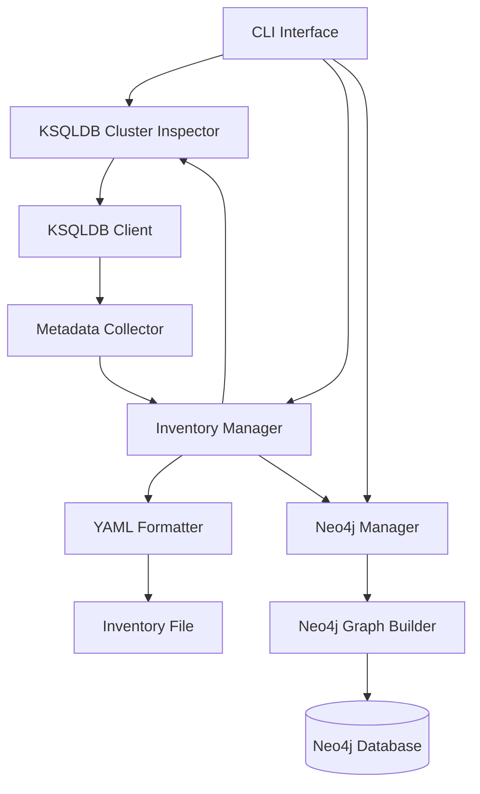

# SD-03: KSQLDB Cluster Inspection and Inventory Management - Solution Design

## Solution Design Overview

### Related Feature Request
[FR-03: KSQLDB Cluster Inspection and Inventory Management](FR-03.md)

### Status
**DRAFT** - Under review

### Version
1.0

### Author(s)
Solution Architect

### Date Created
2025-09-02

---

## Executive Summary

This solution design outlines the technical approach to implement KSQLDB cluster inspection capabilities in the ks-inspector tool. The solution will enable comprehensive metadata collection from KSQLDB servers, storage of this metadata in structured YAML format, and export to Neo4j for advanced analysis and visualization.

---

## Architecture Overview

### Current Architecture Analysis

The existing ks-inspector follows a CLI-driven architecture with these components:
- `CLI.java` - Main entry point and command processing
- Basic KSQLDB client connectivity via REST API
- Simple graph generation with JGraphT
- DOT file export capability
- Basic dependency analysis

### Proposed Architecture Enhancements

#### High-Level Architecture



### Component Design

#### 1. KSQLDB Cluster Inspector (`io.confluent.ksql.inspector`)

**Purpose**: Main orchestrator for KSQLDB cluster inspection functionality

**Key Classes**:
```java
public class KSQLDBClusterInspector {
    private KSQLDBClient client;
    private InventoryManager inventoryManager;
    private Neo4jManager neo4jManager;
    
    public KSQLDBInventory inspectCluster(KSQLDBConfig config);
    public void exportToNeo4j(KSQLDBInventory inventory);
    public void saveInventory(KSQLDBInventory inventory, String filePath);
}

public class KSQLDBConfig {
    private String host;
    private int port;
    private String username;
    private String password;
    private boolean useTls;
    // Getters and setters
}
```

**Responsibilities**:
- Orchestrate the inspection process
- Manage KSQLDB client connections
- Coordinate with inventory and Neo4j managers
- Handle configuration and error management

#### 2. KSQLDB Client (`io.confluent.ksql.client`)

**Purpose**: Interface with KSQLDB server using the official Java API client

**Key Classes**:
```java
public class KSQLDBClient {
    private Client client;
    
    public List<StreamInfo> listStreams();
    public List<TableInfo> listTables();
    public List<TopicInfo> listTopics();
    public List<QueryInfo> listQueries();
    public ServerInfo getServerInfo();
    public SourceDescription describeSource(String sourceName);
}

public class StreamInfo {
    private String name;
    private String topic;
    private String keyFormat;
    private String valueFormat;
    private boolean isWindowed;
    // Getters and setters
}

public class TableInfo {
    private String name;
    private String topic;
    private String keyFormat;
    private String valueFormat;
    // Getters and setters
}

public class TopicInfo {
    private String name;
    private int partitions;
    private int replicas;
    // Getters and setters
}

public class QueryInfo {
    private String id;
    private String queryString;
    private String state;
    private List<String> sinks;
    // Getters and setters
}

public class ServerInfo {
    private String version;
    private String kafkaClusterId;
    private String ksqlServiceId;
    // Getters and setters
}
```

**Responsibilities**:
- Establish and manage connections to KSQLDB servers
- Execute KSQLDB API calls for metadata collection
- Handle authentication and security
- Parse and normalize API responses

#### 3. Inventory Manager (`io.confluent.ksql.inventory`)

**Purpose**: Manage KSQLDB inventory data and serialization

**Key Classes**:
```java
public class InventoryManager {
    public KSQLDBInventory createInventory(KSQLDBMetadata metadata);
    public void saveInventory(KSQLDBInventory inventory, String filePath);
    public KSQLDBInventory loadInventory(String filePath);
}

public class KSQLDBInventory {
    private String clusterId;
    private LocalDateTime collectedAt;
    private ServerInfo serverInfo;
    private List<StreamInfo> streams;
    private List<TableInfo> tables;
    private List<TopicInfo> topics;
    private List<QueryInfo> queries;
    // Getters and setters
}

public class KSQLDBMetadata {
    private ServerInfo serverInfo;
    private List<StreamInfo> streams;
    private List<TableInfo> tables;
    private List<TopicInfo> topics;
    private List<QueryInfo> queries;
    // Getters and setters
}
```

**Responsibilities**:
- Create and manage inventory data structures
- Serialize inventory to YAML format
- Deserialize inventory from YAML format
- Validate inventory data integrity

#### 4. Neo4j Manager (`io.confluent.ksql.neo4j`)

**Purpose**: Export KSQLDB inventory data to Neo4j graph database

**Key Classes**:
```java
public class Neo4jManager {
    private Driver driver;
    
    public void exportInventory(KSQLDBInventory inventory);
    public void clearInventory(String clusterId);
    public List<StreamInfo> queryStreams(String cypherQuery);
}

public class Neo4jQueryTemplates {
    public static final String CREATE_STREAM_NODE = "MERGE (s:KSQLStream {name: $name}) SET s.topic = $topic, s.keyFormat = $keyFormat, s.valueFormat = $valueFormat";
    public static final String CREATE_TABLE_NODE = "MERGE (t:KSQLTable {name: $name}) SET t.topic = $topic, t.keyFormat = $keyFormat, t.valueFormat = $valueFormat";
    public static final String CREATE_TOPIC_NODE = "MERGE (t:KafkaTopic {name: $name}) SET t.partitions = $partitions, t.replicas = $replicas";
    public static final String CREATE_QUERY_NODE = "MERGE (q:KSQLQuery {id: $id}) SET q.queryString = $queryString, q.state = $state";
    public static final String REL_STREAM_BACKED_BY_TOPIC = "MATCH (s:KSQLStream {name: $streamName}), (t:KafkaTopic {name: $topicName}) MERGE (s)-[:BACKED_BY]->(t)";
    public static final String REL_TABLE_BACKED_BY_TOPIC = "MATCH (t:KSQLTable {name: $tableName}), (k:KafkaTopic {name: $topicName}) MERGE (t)-[:BACKED_BY]->(k)";
    public static final String REL_QUERY_WRITES_TO_STREAM = "MATCH (q:KSQLQuery {id: $queryId}), (s:KSQLStream {name: $streamName}) MERGE (q)-[:WRITES_TO]->(s)";
    public static final String REL_QUERY_WRITES_TO_TABLE = "MATCH (q:KSQLQuery {id: $queryId}), (t:KSQLTable {name: $tableName}) MERGE (q)-[:WRITES_TO]->(t)";
}
```

**Responsibilities**:
- Establish and manage connections to Neo4j
- Map KSQLDB entities to Neo4j nodes
- Create relationships between entities
- Handle incremental updates and data synchronization

---

## Data Model

### KSQLDB Inventory Data Model

The KSQLDB inventory will be structured as follows:

```yaml
cluster:
  id: "ksql-cluster-1"
  collectedAt: "2025-09-02T10:30:00Z"
  serverInfo:
    version: "0.29.0"
    kafkaClusterId: "cluster-1"
    ksqlServiceId: "ksql-service-1"

streams:
  - name: "pageviews_stream"
    topic: "pageviews"
    keyFormat: "KAFKA"
    valueFormat: "JSON"
    isWindowed: false

tables:
  - name: "users_table"
    topic: "users"
    keyFormat: "KAFKA"
    valueFormat: "AVRO"

topics:
  - name: "pageviews"
    partitions: 6
    replicas: 3

queries:
  - id: "CSAS_PAGEVIEWS_STREAM_0"
    queryString: "CREATE STREAM pageviews_stream WITH (KAFKA_TOPIC='pageviews', VALUE_FORMAT='JSON');"
    state: "RUNNING"
    sinks: ["pageviews_stream"]
```

### Neo4j Graph Data Model

The Neo4j graph will use the following node labels and relationship types:

**Node Labels**:
- `:KSQLCluster` - Represents a KSQLDB cluster
- `:KSQLStream` - Represents a KSQLDB stream
- `:KSQLTable` - Represents a KSQLDB table
- `:KafkaTopic` - Represents a Kafka topic
- `:KSQLQuery` - Represents a KSQLDB query

**Relationship Types**:
- `(:KSQLStream)-[:BACKED_BY]->(:KafkaTopic)` - Stream is backed by topic
- `(:KSQLTable)-[:BACKED_BY]->(:KafkaTopic)` - Table is backed by topic
- `(:KSQLQuery)-[:WRITES_TO]->(:KSQLStream)` - Query writes to stream
- `(:KSQLQuery)-[:WRITES_TO]->(:KSQLTable)` - Query writes to table
- `(:KSQLCluster)-[:CONTAINS]->(:KSQLStream)` - Cluster contains stream
- `(:KSQLCluster)-[:CONTAINS]->(:KSQLTable)` - Cluster contains table

---

## Implementation Plan

### Phase 1: Core KSQLDB Client Implementation
1. Implement KSQLDBClient class with basic connectivity
2. Implement methods to retrieve streams, tables, topics, and queries
3. Add authentication and security support
4. Create unit tests for client functionality

### Phase 2: Inventory Management
1. Implement KSQLDBInventory and related data classes
2. Implement YAML serialization/deserialization
3. Create inventory creation and management logic
4. Add validation for inventory data

### Phase 3: Neo4j Integration
1. Implement Neo4jManager class
2. Create node and relationship mapping logic
3. Implement export functionality
4. Add support for incremental updates

### Phase 4: CLI Integration
1. Add new CLI commands for KSQLDB inspection
2. Implement command-line argument parsing
3. Add progress feedback and error handling
4. Create integration tests

### Phase 5: Documentation and Testing
1. Create user documentation
2. Develop comprehensive test suite
3. Performance testing with large datasets
4. Security and reliability validation

---

## Deployment Considerations

### Backward Compatibility
- New functionality will be added as additional CLI commands
- Existing functionality will remain unchanged
- Configuration files will be extended, not modified

### Performance Optimization
- Implement connection pooling for KSQLDB clients
- Use batching for Neo4j operations
- Add caching for frequently accessed metadata
- Optimize YAML serialization for large inventories

### Security
- Support for TLS connections to KSQLDB servers
- Secure credential management via environment variables
- Encryption for data at rest in inventory files
- Role-based access control for Neo4j operations

---

## Monitoring and Logging

### Logging Strategy
- Structured logging for inspection processes
- Performance metrics for data collection
- Error tracking and failure analysis
- Audit trails for inventory changes

### Monitoring
- Health checks for KSQLDB connections
- Performance metrics for Neo4j operations
- Inventory freshness tracking
- Resource utilization monitoring

---

## Testing Strategy

### Unit Testing
- Test individual components in isolation
- Mock external dependencies (KSQLDB server, Neo4j)
- Validate data transformations and mappings
- Test error handling and edge cases

### Integration Testing
- Test end-to-end inspection workflows
- Validate YAML serialization/deserialization
- Test Neo4j export and query functionality
- Verify CLI command execution

### Performance Testing
- Test with large KSQLDB clusters
- Measure inspection time for various cluster sizes
- Validate memory usage during inspection
- Test concurrent inspection processes

### Security Testing
- Validate authentication mechanisms
- Test secure credential handling
- Verify data encryption
- Check for potential injection vulnerabilities